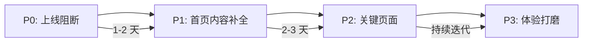

# 🔍 AI Beauty Stylist — 首页 & 上线验收审计报告

> **审计视角**: 产品经理 · SEO 专家 · 妆容大师 · UI/UX 架构师
> **审计范围**: 首页 ([index.astro](file:///c:/antigravity/aibeautystylist/src/pages/index.astro)) 为核心，辐射全站上线准备度
> **审计日期**: 2026-06-10

---

## ✅ 已有能力盘点

先确认你已经做到的部分，这些是非常扎实的基础：

| 维度 | 已完成 |
|------|--------|
| **页面覆盖** | 首页、发现妆容、AI 诊断、定价、试妆（Free/Pro/Premium）、分享卡片、登录、重设密码、账户中心 |
| **后端能力** | 完整 API 层（auth、uploads、tryon-jobs、diagnoses、billing、consents、session、shares） |
| **数据层** | D1 数据库 7 次迁移、lookCatalog 50+ 妆容、产品数据、教程数据 |
| **合规** | 隐私政策、服务条款、AI 免责声明、Cookie 同意、照片处理同意 |
| **支付** | Stripe 集成、Webhook 处理、Portal 管理、订阅事件处理 |
| **SEO 基础** | canonical、OG/Twitter Card、sitemap.xml、语义化 HTML |
| **暗黑模式** | 已实现主题切换 |
| **响应式** | 三档断点适配（1100px / 700px） |

---

## 🚨 P0 — 上线阻断项（必须有）

这些是不做就**无法上线**的内容：

### 1. 首页缺少 Footer
**角色**: UI/UX 架构师 · SEO 专家

[index.html](file:///c:/antigravity/aibeautystylist/index.html)（静态版）没有 `<footer>`。虽然 [index.astro](file:///c:/antigravity/aibeautystylist/src/pages/index.astro) 通过 `BaseLayout` 自带 Footer，但**静态 HTML 版本完全缺失**。

> [!IMPORTANT]
> 建议统一淘汰根目录的静态 `.html` 文件，全部通过 Astro 路由服务。当前存在两套入口（`index.html` vs `index.astro`），用户可能命中无 Footer 的静态版本。

### 2. 移动端汉堡菜单缺失
**角色**: UI/UX 架构师

在 `@media (max-width: 1100px)` 时，`.nav-links { display: none }` 直接隐藏了导航，但**没有汉堡菜单替代方案**。移动端用户无法导航到发现、诊断、定价等页面。

### 3. `<head>` 缺少 `og:image` / `twitter:image`
**角色**: SEO 专家

[BaseLayout.astro](file:///c:/antigravity/aibeautystylist/src/layouts/BaseLayout.astro) 有 `og:title`、`og:description`，但**没有 `og:image`**。社交分享时没有预览图，CTR 会大幅降低。

### 4. Favicon 引用 `/favicon.svg` 但文件不存在
**角色**: 产品经理

`<link rel="icon" href="/favicon.svg">` 指向的文件在 `public/` 目录下需要确认是否存在。缺少 favicon 会让产品看起来极不专业。

### 5. 「登录 / 注册」认证流程完整性
**角色**: 产品经理

`login.astro`、`reset-password.astro`、`account.astro` 已存在，但需确认：
- 注册流程（是否需要独立的 signup 页面或 login 页面内嵌 tab）
- 邮箱验证流程
- OAuth（Google/微信等第三方登录）

---

## 🔶 P1 — 首页内容补全（强烈建议）

### 6. ❌ 首页缺少「社会证明 / 信任区块」
**角色**: 产品经理 · 妆容大师

首页目前有：Hero → 精选妆容 → 场景推荐 → 上传前说明 → 升级引导。
但**缺少以下高转化区块**：

| 缺失区块 | 作用 | 建议位置 |
|---------|------|---------|
| **用户试妆效果展示** | "看看别人的试妆效果"，真实感 + 社交证明 | 精选妆容下方 |
| **数据社证** | "已有 XX 万次试妆"、"XX 种妆容风格" | Hero 下方 pill 标签 |
| **用户评价/推荐语** | 真实用户的使用感受 | 场景推荐下方 |
| **媒体/KOL 背书** | "被 XX 报道"、"XX 推荐" | Footer 上方 |

### 7. ❌ 首页缺少「使用流程 / How It Works」
**角色**: UI/UX 架构师

虽然「上传前说明」区块有简易 flow（选妆容 → 上传自拍 → 查看效果），但它**嵌套在隐私说明中**，不够突出。需要一个独立的、可视化的 3 步操作指南：

```
1️⃣ 选一个喜欢的妆容 → 2️⃣ 上传你的自拍 → 3️⃣ 查看 AI 试妆效果
```

配合动效或插图，让首次访客**10 秒内理解产品是做什么的**。

### 8. ❌ 首页缺少「AI 能力 / 技术差异化」展示
**角色**: 产品经理 · 妆容大师

作为 AI SAAS 产品，需要告诉用户"我们的 AI 有什么不同"：
- 贴合你的真实肤质和光影
- 不是简单的滤镜贴图
- 基于面部特征的个性化推荐

### 9. ❌ 首页缺少 CTA 锚点和滚动引导
**角色**: UI/UX 架构师

首页 Hero 的两个 CTA 按钮直接跳转到其他页面。建议增加：
- **向下滚动指示**（chevron 动画）引导用户浏览更多首页内容
- **页面内锚点 CTA**：例如"先看看效果"跳转到社会证明区块

---

## 🟡 P2 — 全站关键缺失页面

### 10. 帮助中心 / FAQ 页面
**角色**: 产品经理

目前帮助中心链接都用 `data-toast="帮助中心将在正式版开放"` 处理。上线需要：
- 独立的帮助中心页面（或至少一个 FAQ 汇总页）
- 常见问题：试妆效果不满意怎么办、如何退订、照片安全等

### 11. 「关于我们 / About」页面
**角色**: SEO 专家 · 产品经理

SAAS 上线需要有一个品牌故事页面，包括：
- 团队/品牌介绍
- 产品愿景
- 联系方式

这对 SEO 的 E-E-A-T（Experience, Expertise, Authority, Trust）信号非常重要。

### 12. 「联系我们 / Support」页面
**角色**: 产品经理

用户遇到问题需要有反馈渠道：
- 邮件表单 / 客服邮箱
- 常见问题快速入口
- 社交媒体链接

### 13. 博客 / 美妆知识库
**角色**: SEO 专家 · 妆容大师

对 SEO 长尾流量至关重要：
- "圆脸适合什么妆容"
- "通勤妆容教程"
- "如何选择适合自己的口红色号"

> [!TIP]
> 美妆类的搜索量极大，一个好的内容策略可以带来大量自然流量。建议初期至少准备 5-10 篇核心文章。

### 14. 试妆历史 / 我的收藏
**角色**: 产品经理

导航中有"我的记录"链接但用 toast 占位。正式上线需要：
- 历史试妆记录列表
- 收藏的妆容列表
- 诊断报告历史

---

## 🟢 P3 — 体验打磨 & 增长优化

### 15. 首页加载性能优化
**角色**: SEO 专家

| 问题 | 建议 |
|------|------|
| Hero 图片无 `loading="lazy"` 预设 | Hero 首屏图用 `fetchpriority="high"` + `preload`；下方图片用 `loading="lazy"` |
| 缺少 `<link rel="preconnect">` | 如果用了 Google Fonts / CDN，添加 preconnect |
| 无 WebP 回退策略 | 使用 `<picture>` + `<source>` 提供多格式 |
| CSS 单文件 28KB | 考虑拆分关键 CSS inline + 异步加载非关键样式 |

### 16. 结构化数据 (Schema.org)
**角色**: SEO 专家

建议添加以下 JSON-LD：
- **WebApplication** schema（首页）
- **FAQPage** schema（定价页 FAQ）
- **Product** schema（各价格计划）
- **BreadcrumbList** schema（所有内部页面）

### 17. 首页微动效增强
**角色**: UI/UX 架构师

| 位置 | 建议动效 |
|------|---------|
| Hero 区 | 试妆前后对比滑块自动播放一次小幅滑动 |
| 精选妆容 | 卡片入场交错渐入 (staggered fade-in) |
| 场景卡片 | hover 时卡片内图片轻微放大（已有 ✓） |
| 信任图标 | 滚动时数字 counter 动画 |
| 滚动触发 | `IntersectionObserver` 驱动的 section 入场 |

### 18. 国际化 (i18n) 支持
**角色**: 产品经理

当前 Header 有"简体中文⌄"的语言切换 UI，但 [i18n.ts](file:///c:/antigravity/aibeautystylist/src/lib/i18n.ts) 只有 369 字节，几乎是 stub。如果目标是全球市场：
- 至少需要英文版本
- URL 结构：`/en/`、`/zh/` 路由前缀

### 19. 首页 A/B 测试基建
**角色**: 产品经理

建议在首页 Hero 区支持：
- 不同 slogan 文案测试
- CTA 按钮颜色/文字测试
- 精选妆容顺序测试

### 20. 无障碍 (Accessibility) 增强
**角色**: UI/UX 架构师

| 问题 | 现状 | 建议 |
|------|------|------|
| 跳过导航链接 | 缺失 | 添加 `Skip to main content` 链接 |
| 图标按钮 | 部分 emoji 无 `aria-label` | 全部补上语义 label |
| 颜色对比度 | `--muted: #65738c` 在白底上可能不达 WCAG AA | 验证并调整 |
| 键盘导航 | 对比滑块无键盘支持 | 添加 arrow key 控制 |
| 减少动效偏好 | 无 `prefers-reduced-motion` 处理 | 添加媒体查询 |

### 21. 错误页面体验
**角色**: UI/UX 架构师

[404.astro](file:///c:/antigravity/aibeautystylist/src/pages/404.astro) 已存在，但建议：
- 添加 500 错误页面
- 添加离线/网络断开提示
- 404 页面包含搜索/推荐妆容入口

### 22. PWA / 添加到主屏
**角色**: 产品经理

美妆工具类产品非常适合 PWA：
- `manifest.json`
- Service Worker 缓存策略
- 安装引导 banner

---

## 📊 优先级总览

| 优先级 | 数量 | 核心内容 |
|--------|------|---------|
| **P0 阻断** | 5 项 | 双入口统一、移动导航、OG Image、Favicon、认证完整性 |
| **P1 强建议** | 4 项 | 社会证明、How It Works、AI 差异化、滚动引导 |
| **P2 关键页面** | 5 项 | 帮助中心、关于页、联系页、博客、历史记录 |
| **P3 体验打磨** | 8 项 | 性能、Schema、动效、i18n、A/B、无障碍、错误页、PWA |

---

## 🎯 建议实施路径



> [!IMPORTANT]
> **请告诉我你想优先推进哪些项目**，我会为选中的项目制定具体的实施计划并开始执行。你可以按编号选择（如"先做 1、2、6、7"），也可以直接说"全部 P0 + P1"。
